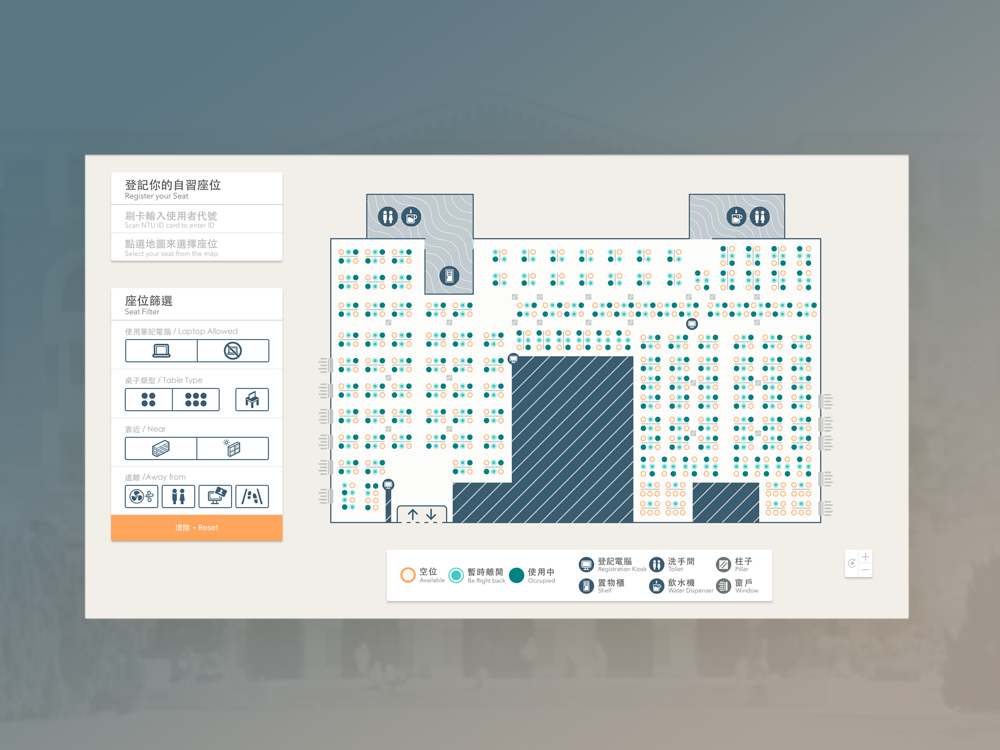

# NTU Library Study Space
National Taiwan University library study space map & register. Get your seat in the elegant way.

[](https://github.com/feross/standard)



## About
The aim of this project is to redesign the registration of study space in National Taiwan University Library, which provide intuitive and interactive way to choose the study seats.
The early design research is [here](http://pt.slideshare.net/lkiral/hack-campus-study-area-experience-design-discover). 

This project is maintained by Hack Campus.
We specialize in the designing and coding of interface and system to improve campus service.

## Requirements
- NodeJS 6.0.0+
- NPM 3.0.0+
- Mongodb 3.0.0+

### Optional for bundle desktop app
**OSX**

- Wine 1.6+ (required to build windows desktop app on OSX)

**Windows**

- Visual Studio 2015
- Python 2.7


## Quick Start

#### Install dependencies

``` bash
npm install
```

#### Run for development

First, be sure running a mongodb

``` bash
# OSX/Linux
mongod

# Windows (be careful of your mongodb path)
C:\Program Files\MongoDB\Server\3.4\bin\mongod.exe

```

Then, run the dev server:

``` bash
# serve with hot reload at localhost:8080
# and graphQL server at localhost:3000/graphql
npm start
```

If you want test with the prodution API:

``` bash
# Use production CheckIn API server in development, which needs credential
cross-env REGISTER_API_ENV=production npm start
```

#### build for production

``` bash
# build for production with minification
npm run build
```

#### Bundle desktop app

``` bash
# Bundle all platform 
npm run release

# Bundle OSX platform
npm run release:darwin

# Bundle Windows platform
npm run release:win32

# Bundle Linux platform
npm run release:linux

# Bundle Windows 32bit platform
npm run release:win32-ia32
```

## Documents
For detailed explanation on how things work, checkout the (docs)[https://lucienlee.gitbooks.io/ntu-library-study-space/]


## Built With

* [Vue](https://vuejs.org/) - The web framework proudly used
* [Vuex](https://github.com/vuejs/vuex) - Manage client-side state
* [D3](https://d3js.org) - Handle svg map interaction
* [GSAP](https://github.com/greensock/GreenSock-JS) - Smooth JS-based Animation
* [Apollo](http://dev.apollodata.com/) - Access server data with GraphQL
* [Electron](http://electron.atom.io/) - Build cross platform desktop apps


## Entry point

In `src/`, there are two entry points, namely `main-library-desktop.js` and
`main-external-client.js`, these are the entry points for the **Electron Desktop
App** for the library and the **Website for external users**.

This is done by using the [code
spilting](https://webpack.github.io/docs/code-splitting.html) feature of webpack.

Differences are things such as fonts are loaded via CDN or included, or some
functions are only included each version.

Currently we are only serving the `libraryDesktop` part

## Contributor and Acknowledge


## License
MIT 

Copyright (c) 2016-2017 Hack Campus

Permission is hereby granted, free of charge, to any person obtaining a copy of this software and associated documentation files (the "Software"), to deal in the Software without restriction, including without limitation the rights to use, copy, modify, merge, publish, distribute, sublicense, and/or sell copies of the Software, and to permit persons to whom the Software is furnished to do so, subject to the following conditions:

The above copyright notice and this permission notice shall be included in all copies or substantial portions of the Software.

THE SOFTWARE IS PROVIDED "AS IS", WITHOUT WARRANTY OF ANY KIND, EXPRESS OR IMPLIED, INCLUDING BUT NOT LIMITED TO THE WARRANTIES OF MERCHANTABILITY, FITNESS FOR A PARTICULAR PURPOSE AND NONINFRINGEMENT. IN NO EVENT SHALL THE AUTHORS OR COPYRIGHT HOLDERS BE LIABLE FOR ANY CLAIM, DAMAGES OR OTHER LIABILITY, WHETHER IN AN ACTION OF CONTRACT, TORT OR OTHERWISE, ARISING FROM, OUT OF OR IN CONNECTION WITH THE SOFTWARE OR THE USE OR OTHER DEALINGS IN THE SOFTWARE.